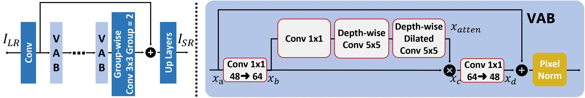

#  VapSR
Efficient Image Super-Resolution using Vast-Receptive-Field Attention(ECCVW 2022). [Paper link](https://arxiv.org/abs/2210.05960)

Lin Zhou1∗, [Haoming Cai1∗](www.haomingcai.com), [Jinjin Gu](https://www.jasongt.com/), [Zheyuan Li](https://xiaom233.github.io/), Yingqi Liu, [Xiangyu Chen](https://chxy95.github.io/), [Yu Qiao](http://mmlab.siat.ac.cn/yuqiao/), [Chao Dong](https://scholar.google.com.hk/citations?user=OSDCB0UAAAAJ&hl=en) (* indicates equal contribution)

>The attention mechanism plays a pivotal role in designing advanced super-resolution (SR) networks. In this work, we design an efficient SR network by improving the attention mechanism. We start from a simple pixel attention module and gradually modify it to achieve better super-resolution performance with reduced parameters. The specific approaches include: (1) increasing the receptive field of the attention branch, (2) replacing large dense convolution kernels with depthwise separable convolutions, and (3) introducing pixel normalization. These approaches paint a clear evolutionary roadmap for the design of attention mechanisms. Based on these observations, we propose VapSR, the Vast-receptive-field Pixel attention network. Experiments demonstrate the superior performance of VapSR. VapSR outperforms the present lightweight networks with even fewer parameters. And the light version of VapSR can use only 21.68% and 28.18% parameters of IMDB and RFDN to achieve similar performances to those networks.

Quick Intro: [the presentation and the poster](https://drive.google.com/drive/folders/1nRvdlu6AmBwgVCOxw21s1m7nQm7l3ZqU?usp=sharing).

<!--  -->


Performance of X4 scale (PSNR / SSIM on Y channel):
| <sub> model </sub> | <sub> Pararms[K] </sub> | <sub> Set5 </sub> | <sub> Set14 </sub> |  <sub> B100 </sub> | <sub> Urban100 </sub> |
|  :----:  | :----:  |  :----:  | :----:  |  :----:  | :----:  |
|  VapSR-S  | 155 | 32.14/0.8951 | 28.64/0.7826 | 27.60/0.7373 | 26.05/0.7852 |
|  VapSR  | 342 | 32.38/0.8978 | 28.77/0.7852 | 27.68/0.7398 | 26.35/0.7941 |

---

## Code Directions
The code is constructed based on [BasicSR](https://github.com/XPixelGroup/BasicSR). Before any testing or reproducing, make sure the [installation](https://github.com/XPixelGroup/BasicSR/blob/master/docs/INSTALL.md) and the [datasets preparation](https://github.com/XPixelGroup/BasicSR/blob/master/docs/DatasetPreparation.md) are done correctly.

<!--The version of BasicSR we use is '1.3.4.9'.-->

To keep the workspace clean and simple, only `test.py`, `train.py` and `your_arch.py` are needed here and then you are good to go.

This line in `test.py` and `train.py` enables them to register your arch:
```
from vapsr import vapsr
```


## Testing
The provided pth files contain two models each, one is the EMA model and the other is the in-training-progress model with larger parameters. Our testing results are produced by the EMA models.

To load them, you can either remove the other model in the file and rename the key of the EMA model from 'params_ema' to 'params'. You need to make the process for every model you test.

Or you can change the BasicSR’s code in the position of `BasicSR/basicsr/models/sr_model.py line29` from
```
param_key = self.opt['path'].get('param_key_g', 'params')
```
to
```
param_key = self.opt['path'].get('param_key_g', 'params_ema')
```
Note this will change the behavior of the consuming training (load and train). Make sure you know which model you need and which model you loaded.

You can run the testing demo with
```
>>> CUDA_VISIBLE_DEVICES=0 python code/test.py -opt options/test/VapSR_X4.yml
```
<!--VapSR_X4.pth, VapSR-S and VapSR_X3.pth tested, almost the same.-->

## Training
Reproduce with
```
>>> CUDA_VISIBLE_DEVICES=0,1 python -m torch.distributed.launch --nproc_per_node=2 --master_port=4321 code/train.py -opt options/train/VapSR_X4.yml --launcher pytorch
```
<!--VapSR_X4 and VapSR_X2 reproduced, even slightly better.-->
